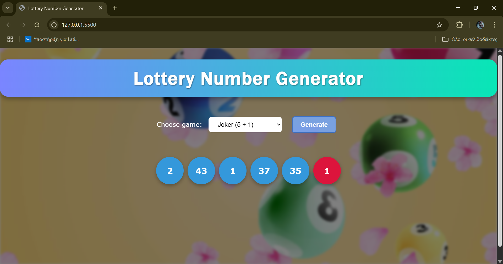

# Lottery Number Generator

A responsive web application that generates random lottery numbers for popular games or fully custom rules. Built with vanilla HTML, CSS, and JavaScript—no frameworks required.

---

## Table of Contents

1. [Demo](#demo)
2. [Features](#features)
3. [Screenshot](#screenshot)
4. [Getting Started](#getting-started)
5. [Project Structure](#project-structure)
6. [Built With](#built-with)
7. [Roadmap](#roadmap)
8. [License](#license)

---

## Demo

Live preview (GitHub Pages)  
<https://CEYEb3r.github.io/lottery-generator/>

---

## Features

| Category        | Details                                                                                                   |
|-----------------|-----------------------------------------------------------------------------------------------------------|
| Game Modes      | • Joker (5 numbers 1–45 plus a Joker 1–20)  <br> • Lotto (6 numbers 1–49)  <br> • Custom (1–20 numbers, user-defined max, optional Joker) |
| Validation      | Blocks blank, negative, or impossible requests (e.g., 10 uniques from 1–5)                                |
| Responsive UI   | Flex-box layout adapts to desktop, tablet, and mobile                                                     |
| Animation       | Each number “pops” into view                                                                              |
| Clean Code      | Plain HTML, CSS, and ES6 JavaScript                                                                       |

---

## Screenshot





---

## Getting Started

Clone the repository and open `index.html`, or serve the folder with a local web server.

```bash
git clone https://github.com/CEYEb3r/lottery-generator.git
cd lottery-generator
# Option 1: open index.html directly
# Option 2: serve locally (requires Node.js)
npx serve .
