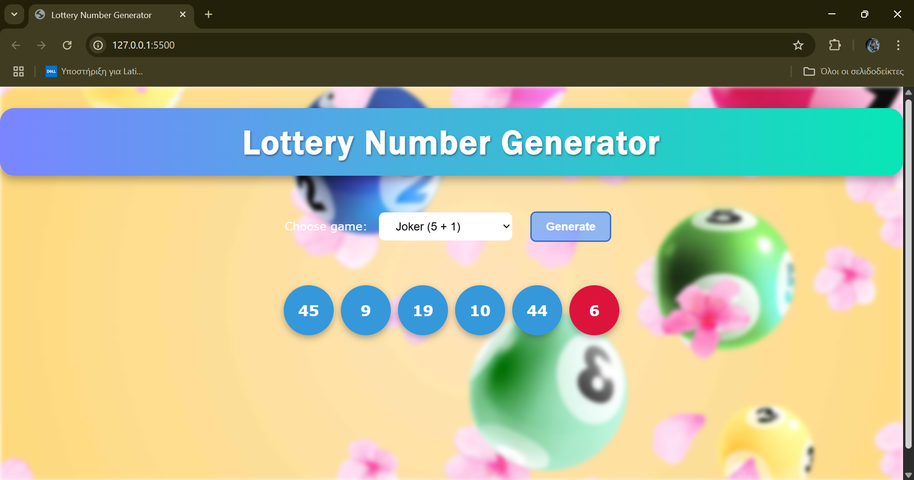
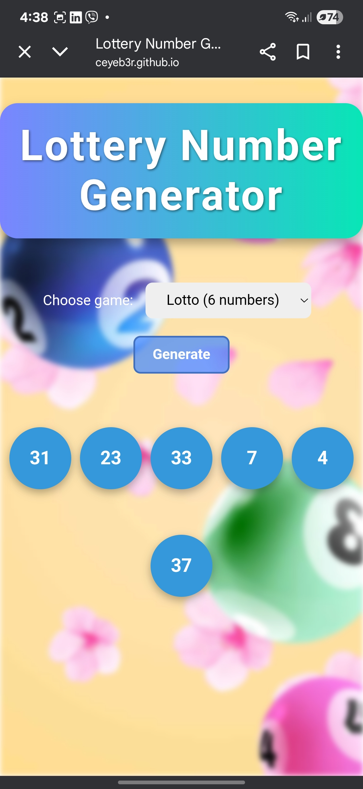

# Lottery Number Generator

A responsive web application that generates random lottery numbers for popular games or custom rules. Built with vanilla HTML, CSS, and JavaScript—no frameworks or external dependencies.

---

## Table of Contents

1. [Demo](#demo)
2. [Features](#features)
3. [Screenshots](#screenshots)
4. [Getting Started](#getting-started)
5. [Project Structure](#project-structure)
6. [Built With](#built-with)
7. [License](#license)

---

## Demo

Live preview on GitHub Pages:
**[https://CEYEb3r.github.io/lottery-generator/](https://CEYEb3r.github.io/lottery-generator/)**

> **Note:** Brave browser may block the background image due to its strict privacy filters.
> For best results, open the site in Chrome or Firefox.

---

## Features

| Category       | Details                                                                                                       |
|----------------|---------------------------------------------------------------------------------------------------------------|
| Game Modes     | • Joker (5 numbers 1–45 + Joker 1–20) <br> • Lotto (6 numbers 1–49) <br> • Custom (1–20 numbers, user-defined max, optional Joker) |
| Validation     | Prevents blank, negative, or impossible inputs (e.g., too many uniques for a small range)                    |
| Responsive UI  | Flexbox layout adapts to desktop, tablet, and mobile                                                          |
| Animation      | Number balls “pop” into view with scale transform                                                             |
| Clean Code     | Straightforward HTML, CSS, and ES6 JavaScript                                                                 |
                                                     

---

## Screenshots

<p align="center">
  
  
</p>


---

## Getting Started

Clone the repository and run locally:

```bash
git clone https://github.com/CEYEb3r/lottery-generator.git
cd lottery-generator

# Option 1: Open index.html directly in a browser
# Option 2: Serve locally (requires Node.js installed)
npx serve .
```

---

## Project Structure

```
lottery-generator/
├── assets/                  # Images & screenshots
│   ├── screenshot-desktop.png
│   └── screenshot-mobile.jpg
├── background.jpg           # Background image
├── index.html               # Main HTML file
├── index.js                 # JavaScript logic
├── style.css                # CSS styles
├── LICENSE                  # MIT License
└── README.md                # Project documentation

---

## Built With

* HTML5
* CSS3 (Flexbox, gradients, keyframe animation)
* JavaScript (ES6)

---

## License

This project is licensed under the [MIT License](LICENSE).
